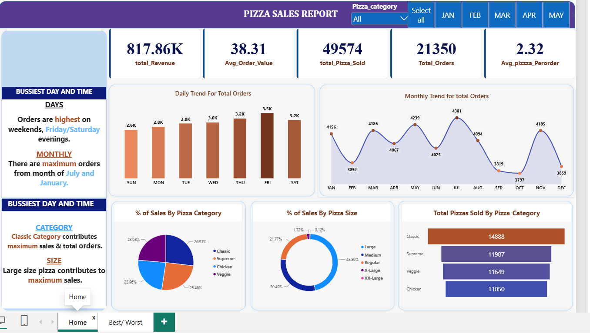
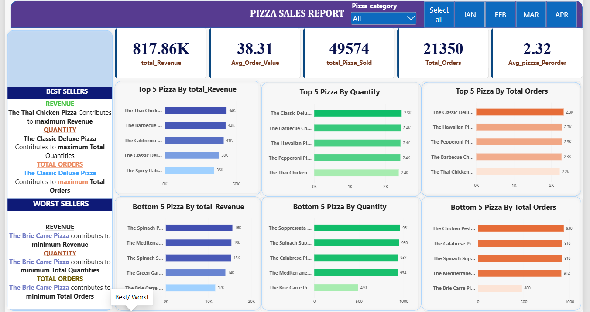

# 🍕 Pizza Sales Analysis Dashboard

## 📊 Project Overview

This project analyzes pizza sales data to identify sales trends, customer preferences, and business performance using Power BI, SQL, and Excel.

## 🛠️ Tools & Technologies

- Power BI
- SQL
- Microsoft Excel
- Data Analysis
- Data Visualization
  
- ## 🗄️ SQL Queries

The following SQL queries were created to analyze key KPIs and sales performance:

-- Total Revenue
SELECT SUM(total_price) AS Total_Revenue
FROM pizza_sales;

-- Total Orders
SELECT COUNT(DISTINCT order_id) AS Total_Orders
FROM pizza_sales;

-- Total Pizzas Sold
SELECT SUM(quantity) AS Total_Pizzas_Sold
FROM pizza_sales;

-- Average Order Value
SELECT SUM(total_price) / COUNT(DISTINCT order_id) AS Average_Order_Value
FROM pizza_sales;

-- Average Pizzas Per Order
SELECT SUM(quantity) / COUNT(DISTINCT order_id) AS Average_Pizzas_Per_Order
FROM pizza_sales;

-- Top 5 Pizzas by Revenue
SELECT TOP 5 pizza_name, SUM(total_price) AS Total_Revenue
FROM pizza_sales
GROUP BY pizza_name
ORDER BY Total_Revenue DESC;

-- Top 5 Pizzas by Quantity
SELECT TOP 5 pizza_name, SUM(quantity) AS Total_Quantity
FROM pizza_sales
GROUP BY pizza_name
ORDER BY Total_Quantity DESC;

-- Top 5 Pizzas by Orders
SELECT TOP 5 pizza_name, COUNT(DISTINCT order_id) AS Total_Orders
FROM pizza_sales
GROUP BY pizza_name
ORDER BY Total_Orders DESC;

-- Revenue by Pizza Category
SELECT pizza_category, SUM(total_price) AS Total_Revenue
FROM pizza_sales
GROUP BY pizza_category
ORDER BY Total_Revenue DESC;

-- Monthly Revenue
SELECT MONTH(order_date) AS Month, SUM(total_price) AS Total_Revenue
FROM pizza_sales
GROUP BY MONTH(order_date)
ORDER BY Month;

## 📌 Key KPIs

- Total Revenue
- Total Orders
- Total Pizzas Sold
- Average Order Value
- Average Pizzas per Order

## 📈 Dashboard

The Power BI dashboard provides insights into:

- Daily and monthly sales trends
- Sales by pizza category
- Sales by pizza size
- Best-selling pizzas
- Total revenue and orders
- Customer ordering patterns

## 🔍 Key Insights

The dashboard helps identify:

- Top-performing pizza categories
- Most popular pizza sizes
- Best-selling pizzas
- Peak sales periods
- Revenue trends

## 📂 Project Files

- `Pizza_Sales_Dashboard.pbix` – Power BI dashboard
- `pizza_sales.csv` – Dataset
- `pizza_sales_excel_file (1).xlsx` – Excel dataset
- `PIZZA SALES SQL QUERIES (1).docx` – SQL queries
- Dashboard screenshots

## 💡 Skills Demonstrated

- Data cleaning
- SQL querying
- Data analysis
- Power BI dashboard development
- KPI creation
- Data visualization
- Business insights generation

## 📊 Dashboard Preview

## 📈 Sales Analysis

